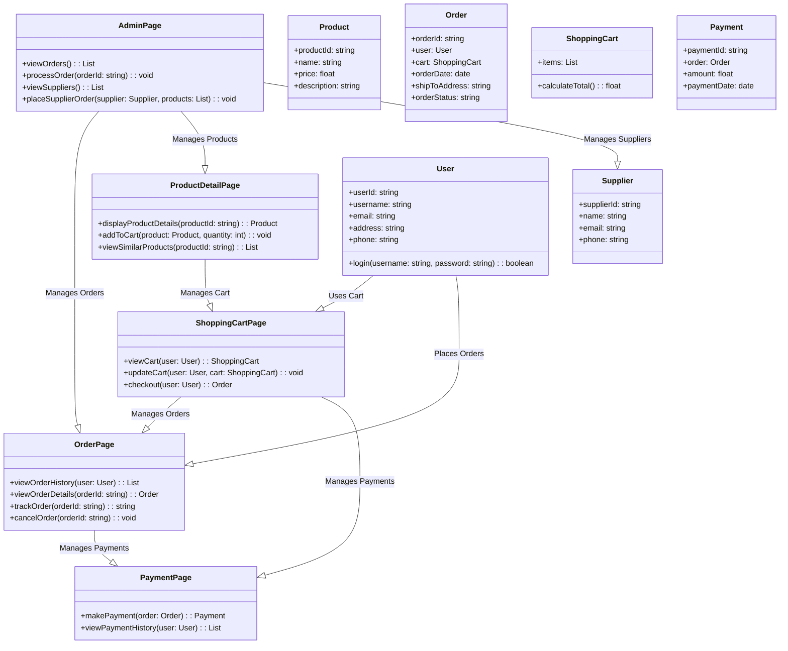

# ChatGPT

## 1. github 공개 레포지토리를 만들고 URL을 공개하십시오.
[ChatGPT 활용 온라인헬퍼 챗봇 개발 레포지토리 (클릭)](https://github.com/nryeo/chatgpt.git)

<br>

## 2. 개발자용 프롬프트 3가지 이상을 작성하시오. (그 중 한 가지는 UML과제)

### Prompt1
너는 웹스크레이핑 전문가야. 
특정 검색화면에서 목록이 나왔을 때 목록의 개개의 건을 클릭하여 내부의 텍스트를 스크레이핑하는 코드를 파이썬을 사용하여 만들어줘. 

<details>
<summary>Answer</summary>
웹스크레이핑은 웹사이트의 구조나 HTML의 변경 등에 영향을 받기 때문에 구체적인 사이트에 따라 코드가 다를 수 있습니다. 
그러나 아래의 예시 코드는 기본적인 프로세스를 보여주는 것이므로 참고로 사용해주세요. 이 코드는 requests와 BeautifulSoup 라이브러리를 사용하여 구현되었습니다.

먼저, 검색 화면에서 목록을 가져오는 코드입니다:

```python
import requests
from bs4 import BeautifulSoup

def get_search_results(query):
    url = f'https://www.example.com/search?q={query}'
    response = requests.get(url)

    if response.status_code == 200:
        soup = BeautifulSoup(response.text, 'html.parser')
        # 여기에서 목록을 가져오는 코드 작성
        results = soup.find_all('div', class_='result-item')  # 예시: 결과가 div 태그의 'result-item' 클래스에 들어있다고 가정
        return results
    else:
        print(f'Failed to retrieve search results. Status code: {response.status_code}')
        return []

# 예시로 "Python" 검색 결과 가져오기
search_results = get_search_results('Python')

# 각 결과 항목에 대해 텍스트를 스크레이핑하는 코드
for result in search_results:
    # 결과 항목을 클릭하여 내부 페이지로 이동
    link = result.find('a')['href']
    inner_page_response = requests.get(link)

    if inner_page_response.status_code == 200:
        inner_soup = BeautifulSoup(inner_page_response.text, 'html.parser')
        # 여기에서 내부 텍스트를 가져오는 코드 작성
        inner_text = inner_soup.find('div', class_='content').text  # 예시: 내용이 div 태그의 'content' 클래스에 들어있다고 가정
        print(inner_text)
    else:
        print(f'Failed to retrieve inner page. Status code: {inner_page_response.status_code}')

```
이 코드에서는 검색 결과 페이지에서 목록을 가져오고, 각 결과 항목에 대해 링크를 추출하여 해당 링크로 이동한 후 내부 페이지의 텍스트를 스크레이핑합니다. 
검색 결과 목록이나 내부 페이지의 HTML 구조는 실제 웹사이트에 따라 다를 수 있으므로 코드를 웹사이트에 맞게 수정해야 합니다. 
필요한 정보가 어디에 있는지 확인하려면 웹 브라우저의 개발자 도구를 사용하면 도움이 됩니다.

</details> 

---

### Prompt2 
너는 시스템 설계 및 아키텍처 전문가야. 
다양한 품목을 취급하는 쇼핑몰 홈페이지에서 거래처 발주, 고객 주문 확인 기능과 같은 관리자 페이지와 제품 상세 페이지, 
고객이 사용하는 장바구니, 주문 및 결제 페이지를 포함한 쇼핑몰 아키텍처를 설계하고 mermaid uml 다이어그램을 작성해줘.

<details>
  <summary>Answer</summary>
  다양한 품목을 취급하는 쇼핑몰의 아키텍처를 설계한 Mermaid UML 다이어그램을 작성해보겠습니다. 다이어그램은 다양한 모듈 및 페이지 간의 상호 작용을 보여줍니다.
    


이 다이어그램은 다음과 같은 주요 모듈 및 페이지를 보여줍니다.

1. AdminPage: 관리자 페이지에서 주문 처리, 거래처 발주 및 관련 기능을 수행합니다.
2. ProductDetailPage: 제품 상세 정보 및 유사 제품을 보여주는 페이지입니다.
3. ShoppingCartPage: 고객이 장바구니를 관리하고 주문을 진행하는 페이지입니다.
4. OrderPage: 주문 내역, 주문 상세 정보 및 주문 취소 기능을 제공하는 페이지입니다.
5. PaymentPage: 결제 기능을 수행하는 페이지입니다.
6. Supplier: 거래처에 대한 정보를 나타내는 클래스입니다.
7. User: 사용자 정보와 로그인 기능을 제공하는 클래스입니다.
8. Product: 제품에 대한 정보를 나타내는 클래스입니다.
9. Order: 주문 정보를 나타내는 클래스입니다.
10. ShoppingCart: 장바구니에 대한 정보를 나타내는 클래스입니다.
11. Payment: 결제 정보를 나타내는 클래스입니다.
이 다이어그램은 쇼핑몰의 다양한 기능을 시각적으로 표현하며, 각 모듈 간의 관계를 보여줍니다. 이를 기반으로 시스템의 설계와 아키텍처를 더 자세히 개발할 수 있습니다.
  
</details>

---

### Prompt3
딸기 생육에 관한 데이터를 전염병에 걸린 딸기를 포함해 JSON으로 샘플 5개 만들어줘.

<details>
  <summary>Answer</summary>
  아래는 딸기 생육에 관한 데이터를 나타내는 JSON 샘플 5개입니다. 이 중 하나는 전염병에 걸린 딸기에 대한 정보도 포함되어 있습니다.

  ```json
  [
  {
    "id": 1,
    "variety": "서울 딸기",
    "growth_stage": "개화 기간",
    "temperature": 25,
    "humidity": 70,
    "disease": null
  },
  {
    "id": 2,
    "variety": "제주 딸기",
    "growth_stage": "과실 생장 기간",
    "temperature": 28,
    "humidity": 65,
    "disease": "탄저병"
  },
  {
    "id": 3,
    "variety": "신안 딸기",
    "growth_stage": "수확 기간",
    "temperature": 26,
    "humidity": 75,
    "disease": null
  },
  {
    "id": 4,
    "variety": "경북 딸기",
    "growth_stage": "씨앗 발아 기간",
    "temperature": 22,
    "humidity": 68,
    "disease": "녹농병"
  },
  {
    "id": 5,
    "variety": "전남 딸기",
    "growth_stage": "씨앗 싹트는 기간",
    "temperature": 24,
    "humidity": 72,
    "disease": null
  }
]
```

이 데이터는 딸기의 종류(variety), 생육 단계(growth_stage), 온도(temperature), 습도(humidity), 그리고 전염병 여부(disease)를 포함합니다. 
전염병에 걸린 경우에는 해당 전염병의 이름이 기록되어 있습니다.

</details>

<br>

## 3. ADA 프롬프트 3가지 이상을 작성하시오.
Advanced Data Analysis

### Prompt1
일시, 구분, 미세먼지(PM10), 초미세먼지(PM2.5)의 피처로 이루어진 '서울시 대기질 자료 제공_2022.csv'파일에서 '구분'이 '동작구'인 경우만 '일자'에 따른 '미세먼지(PM10)'와 '초미세먼지(PM2.5)'의 변화 추이를 라인차트로 그려줘. 단, 일자가 YYYY-MM-DD hh:mm:ss 형식인데 월 평균으로 변환해서.

---

### Prompt2
지구가 모두 물로 이루어져 있다고 가정하고 지구의 무게 추정치를 알려줘.

---

### Prompt3
1,11,12,1121,1321,122131, ...와 같은 수열이 있을 때 이 다음에 올 숫자는 뭐야?

<br>

## 4. ChatGPT 플러그인 프롬프트 

### Prompt1
Link reader: <br>
https://lifegoodtip.tistory.com/378 이 페이지의 내용을 요약해줘

---

### Prompt2
Show me: <br>
show me a diagram that describes process of chain learning 

---

### Prompt3
Expedia: <br>
제주도 중문단지 2박 3일 숙소 추천해줘.
