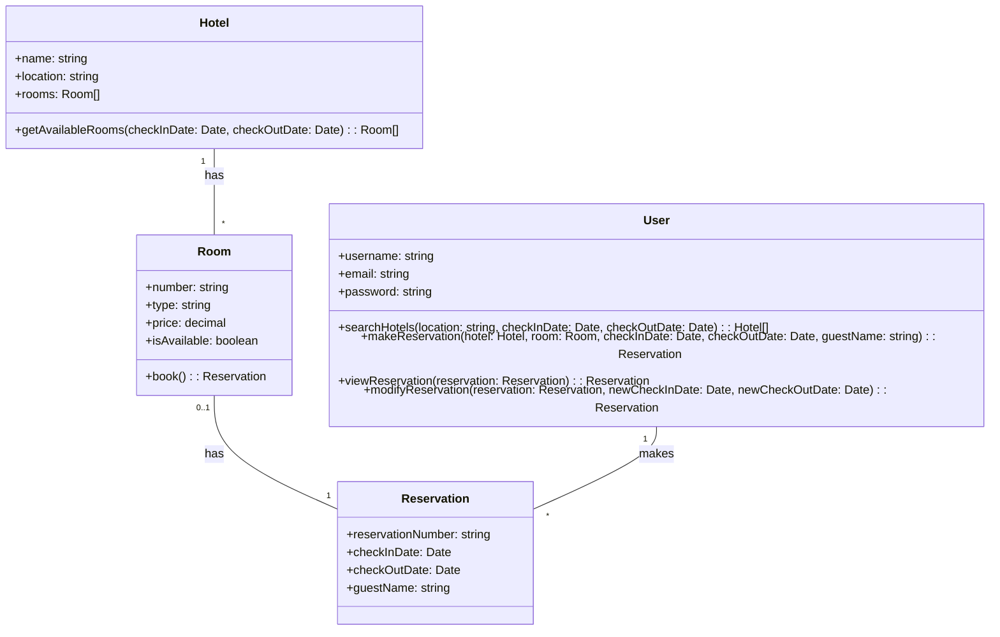
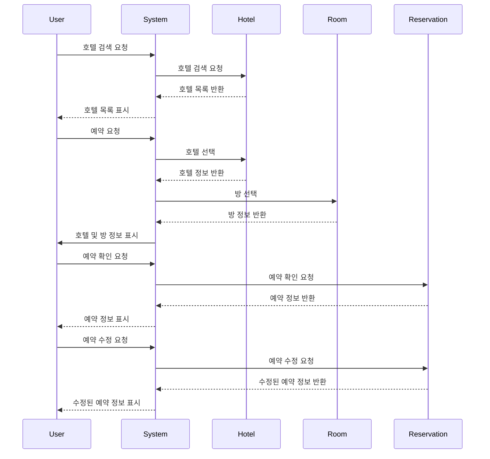

# ChatGPT

## Prompt1 
너는 시스템 설계 및 아키텍처 전문가야. 호텔 예약 시스템을 설계하고 mermaid UML 다이어그램을 작성해줘.

---

호텔 예약 시스템 설계 요약:
- 시스템은 여러 호텔을 관리하고, 각 호텔은 다양한 방 타입을 제공합니다.
- 사용자는 호텔을 검색하고 예약할 수 있으며, 예약 정보를 확인하고 수정할 수 있어야 합니다.
- 예약 시스템은 사용 가능한 방의 가용성을 추적하고, 예약이 생성되면 해당 방을 예약 중으로 표시해야 합니다.

다음은 이 시스템 설계에 기반한 Mermaid UML 다이어그램입니다.

위의 다이어그램에서는 다음과 같은 클래스들과 관계를 표현합니다:

- Hotel: 호텔을 나타내는 클래스로, 호텔의 이름, 위치, 방 목록 및 사용 가능한 방을 확인하는 메서드를 가집니다.
- Room: 방을 나타내는 클래스로, 방 번호, 방 타입, 가격, 예약 가능 여부 및 예약을 생성하는 메서드를 가집니다.
- Reservation: 예약을 나타내는 클래스로, 예약 번호, 체크인 날짜, 체크아웃 날짜, 손님 이름을 저장합니다.
- User: 사용자를 나타내는 클래스로, 사용자 이름, 이메일, 비밀번호를 저장하고 호텔 검색, 예약, 예약 확인, 예약 수정 메서드를 가집니다.
관계는 다음과 같이 정의됩니다:

Hotel과 Room 사이에는 "has" 관계가 있으며, 각 호텔은 여러 개의 방을 가질 수 있습니다.
Room과 Reservation 사이에는 "has" 관계가 있으며, 각 방은 최대 하나의 예약만 가질 수 있습니다.
User와 Reservation 사이에는 "makes" 관계가 있으며, 한 명의 사용자는 여러 개의 예약을 만들 수 있습니다.
이 다이어그램은 호텔 예약 시스템의 간단한 설계를 시각화한 것이며, 실제 프로젝트에서는 더 많은 상세 사항과 기능을 고려해야 합니다.

---

## Prompt2 
시퀀스 다이어그램도 작성해줘

---

위의 시퀀스 다이어그램에서는 다음과 같은 상호 작용을 나타냅니다:

사용자(User)가 호텔 검색을 요청하고, 시스템(System)이 이를 처리하여 호텔 목록을 반환합니다.
사용자가 특정 호텔을 선택하고, 해당 호텔의 정보를 요청하면, 시스템이 호텔 정보와 방 목록을 반환합니다.
사용자가 특정 방을 선택하고 예약을 요청하면, 시스템이 예약을 생성하고 해당 정보를 사용자에게 표시합니다.
사용자가 예약을 확인하거나 수정하기 위해 예약 정보를 요청하면, 시스템이 해당 예약 정보를 반환하고 사용자에게 표시합니다.

